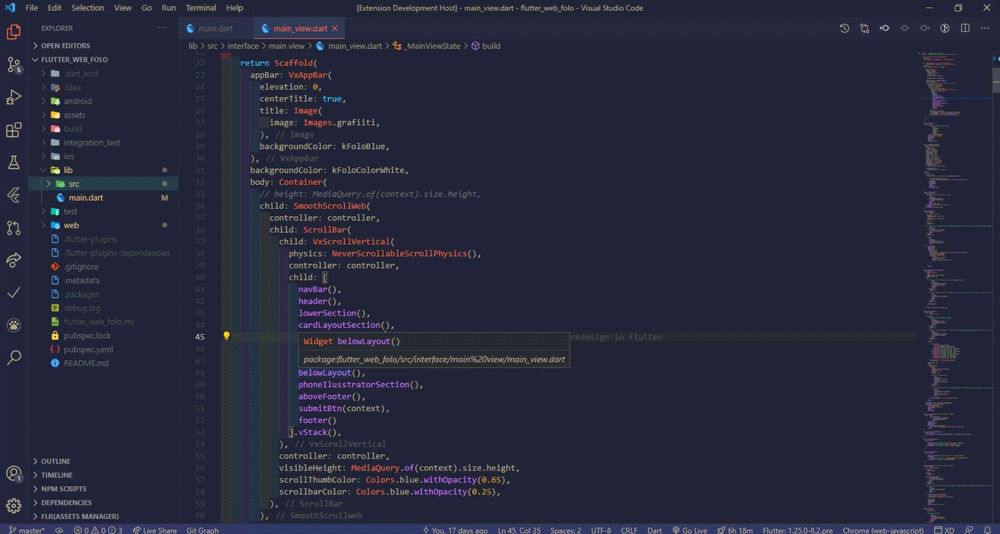

# VelocityX

**Now Updated for velocity_x 1.3.1 release**

This extension for Visual Studio Code adds snippets for Flutter VelocityX(A minimalist Flutter framework for rapidly building custom designs)

## Demo

## Installation

1. Install Visual Studio Code 1.10.0 or higher
1. Launch Code
1. From the command palette `Ctrl`-`Shift`-`P` (Windows, Linux) or `Cmd`-`Shift`-`P` (OSX)
1. Select `Install Extension`
1. Choose the extension
1. Reload Visual Studio Cod

## Release Notes

| 🚀  | New Feature |
| --- | ----------- |
| ✅  | Minor Fix   |
| 🐛  | Bugfix      |

## Known Issues

No known issues so far.